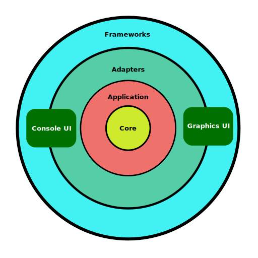

# SnakeGame

A Snake game implementation that demonstrates Clean Architecture principles using ASP.NET Core.

This project prioritizes architectural design over complex gameplay features, serving as a practical showcase for:
- Clean separation of concerns
- SOLID principles applied in practice
- Strategic use of domain-driven design concepts
- Dependency inversion through interfaces
- Highly testable code structure

Built from the ground up as an educational reference, this codebase illustrates architectural patterns in a context different from typical web or enterprise applications.

## Clean Architecture

Clean Architecture is a software design philosophy introduced by Robert C. Martin that arranges code in concentric layers, with dependencies pointing inward. This design creates systems that are:

- **Independent of frameworks**: The architecture doesn't depend on libraries or tools
- **Testable**: Business rules can be tested without UI, database, or external elements
- **Independent of UI**: The interface can change without affecting business rules
- **Independent of database**: Business logic isn't bound to a specific data storage solution
- **Independent of external agencies**: Core business rules don't know about external interfaces

The architecture typically consists of concentric circles representing:
1. **Entities**: Enterprise-wide business rules and data structures
2. **Use Cases**: Application-specific business rules
3. **Interface Adapters**: Converts data between use cases and external formats
4. **Frameworks & Drivers**: External tools, databases, and delivery mechanisms

This separation ensures that technical decisions can be deferred and high-level policies remain unaffected by low-level implementation details.

For the original article visit: https://blog.cleancoder.com/uncle-bob/2012/08/13/the-clean-architecture.html

## Project structure

This application implements Clean Architecture in a multi-project solution. The Core and Application layers each have their own dedicated project, while the Frameworks and Adapters are combined into a single project for each utilized technology (externality) such as Console or SFML Graphics.

### Core
This represents the innermost layer upon which every other layer depends. It contains the domain model of the software:

> Entities are the business objects of the application. They encapsulate the most general and high-level rules.

In the original Clean Architecture article, this layer is called Entities (also known as Core or Domain Layer).
The domain model in this project is implemented as a Rich Domain Model, which encapsulates both data and behavior.

*Note that* Entities in this project are not equivalent to Entities in Domain-Driven Design (DDD), as the domain model in DDD is represented using multiple types of objects such as Aggregates, Entities, and Value Objects.

### Application
This is equivalent to the Use Cases layer in Clean Architecture. It contains orchestration logic for the domain model to fulfill business requirements. Operations that implement business rules reside in this layer.

This layer defines interfaces (also called Ports) that it depends on (IGameInput and IGameOutput), which will be implemented by the UI layers. This approach enforces the Dependency Rule, where dependencies always point inward toward the Core.

### ConsoleUI/GraphicsUI
The ConsoleUI and GraphicsUI projects each represent a distinct UI technology implementation. These are the low-level details that must remain external to the domain, positioned at the outermost rings of the Clean Architecture.

**Framework layer** represents the UI classes and operations that will be used in the application. This layer can also correspond to the external dependency directly like built-in Console or SFML library in our case.

**Adapters Layer** contains adapters that map functionality from the Framework to implement the interfaces required by the Application layer (IGameInput and IGameOutput). These adapters ensure that the outer layers conform to the contracts defined by the inner layers, not vice versa.

## How to play
### Prerequisites
- .NET Core 9.0 SDK which you can download from https://dotnet.microsoft.com/en-us/download/dotnet/9.0

### Launch Options

**Console Interface:**

`dotnet run --project src/SnakeGame.ConsoleUI`

fullscreen mode: 

`dotnet run --project src/SnakeGame.ConsoleUI -full`

**SFML Graphics Interface:**

`dotnet run --project src/SnakeGame.GraphicsUI`

almost fullscreen mode: 

`dotnet run --project src/SnakeGame.GraphicsUI -full`

### Controls
- Arrow keys: Change snake direction
- Space bar: Pause the game
- ESC: Exit the game

## Demo
### Console UI

https://github.com/user-attachments/assets/565e4fc6-50b1-44c7-94ba-a3f4b55699a2

### Graphics UI

https://github.com/user-attachments/assets/079250a7-5534-4b5a-be8d-ab5ede3debd2
